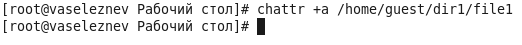
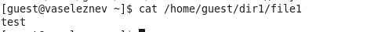
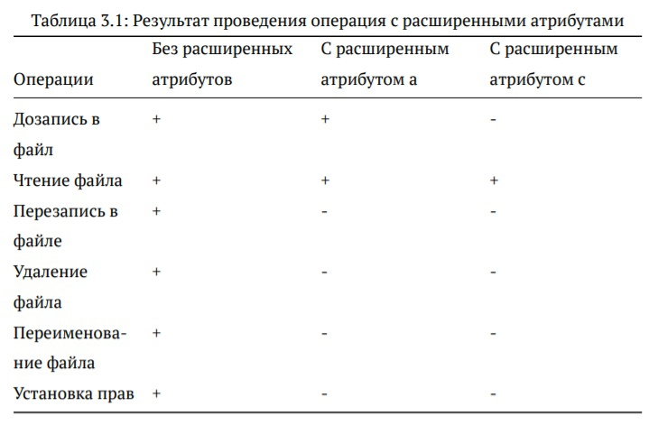

---
## Front matter
lang: ru-RU
title: Лабораторная работа №4
author: |
	Василий А. Селезнев - студент группы НКНбд-01-18
date: 29.10.2021

## Formatting
toc: false
slide_level: 2
theme: metropolis
header-includes: 
 - \metroset{progressbar=frametitle,sectionpage=progressbar,numbering=fraction}
 - '\makeatletter'
 - '\beamer@ignorenonframefalse'
 - '\makeatother'
aspectratio: 43
section-titles: true
---

# Дискреционное разграничение прав в Linux. Расширенные атрибуты

## Цель выполнения лабораторной работы

- Получение практических навыков работы в консоли с расширенными атрибутами файлов

## Задачи выолнения работы

- Создать от имени пользователя файл с расширенным атрибутом \texttt{a} и выполнить ряд операций.
- Снять расширенный атрибут \texttt{a} с файла и выполнить ряд команд
- Заменить расширенный атрибут \texttt{a} на расширенный атрибут \texttt{i} и повторить операции.
- Заполнить таблицу, поясняющую какие операции возможны при различных установленных атрибутах.

## Результаты выполнения лабораторной работы

- Создал от имени пользователя файл с расширенным атрибутом \texttt{a} и выполнил ряд операций. (использовал учётную запись администратора) (рис - @fig:001, рис - @fig:002).

{ #fig:001 width=70% }

{ #fig:002 width=70% }

##

- Снял расширенный атрибут \texttt{a} с файла \texttt{file1} и выполнил ряд команд (рис -@fig:003, рис -@fig:004).

{ #fig:003 width=70% }

{ #fig:004 width=70% }

##

- Заменил расширенный атрибут \texttt{a} на расширенный атрибут \texttt{i} и повторил операции. (рис -@fig:005, рис -@fig:006).

{ #fig:005 width=70% }

{ #fig:006 width=70% }

##

- Была заполнена таблица, поясняющая какие операции возможны при различных установленных атрибутах. (рис -@fig:007)

{ #fig:007 width=70% }

##

Таким образом, я получил практические навыки работы в консоли с расширенными атрибутами файлов